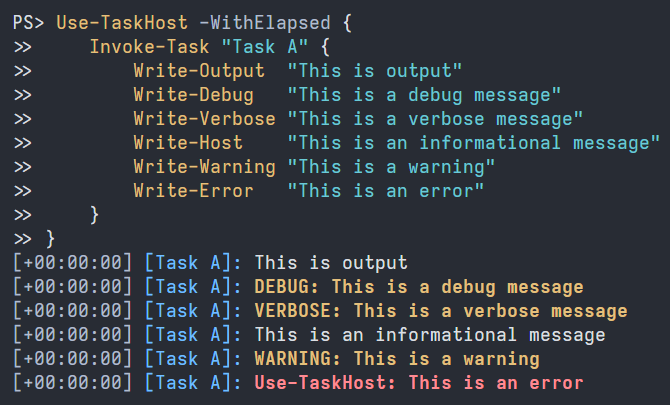

# TaskHost / Subatomix.PowerShell.TaskHost

A thread-safe PowerShell
[`PSHost`](https://learn.microsoft.com/en-us/dotnet/api/system.management.automation.host.pshost)
wrapper to improve the clarity of output from long-running, possibly parallel
tasks.  Available as a PowerShell module or as a NuGet package.

TaskHost adds a wrapper or header to each output object or line, reporting the
elapsed time and which task produced the output.  Line header components
are optional and use color where supported.
 


## Status

[](https://github.com/sharpjs/Subatomix.PowerShell.TaskHost/actions)
[](https://github.com/sharpjs/Subatomix.PowerShell.TaskHost/actions)
[](https://www.powershellgallery.com/packages/TaskHost)
[](https://www.powershellgallery.com/packages/TaskHost)
[](https://www.nuget.org/packages/Subatomix.PowerShell.TaskHost)
[](https://www.nuget.org/packages/Subatomix.PowerShell.TaskHost)

- **Tested:**      100% coverage by automated tests.
- **Documented:**  IntelliSense on everything.  Quick-start guide below.

## Installation

⚠ **These instructions are for version 2.0.**  For version 1.0, see
[the prior version of these instructions](https://github.com/sharpjs/Subatomix.PowerShell.TaskHost/blob/release/1.0.0/README.md).

From PowerShell 7 or later, install [the TaskHost module](https://www.powershellgallery.com/packages/TaskHost):

```ps1
Install-Module TaskHost
```

Update or uninstall the module with `Update-Module` or `Uninstall-Module`,
respectively.

Developers wanting to implement similar features in their own software can install
[the Subatomix.PowerShell.TaskHost NuGet package](https://www.nuget.org/packages/Subatomix.PowerShell.TaskHost)
to get the building blocks of the TaskHost module.

## Usage

⚠ **These instructions are for version 2.0.**  For version 1.0, see
[the prior version of these instructions](https://github.com/sharpjs/Subatomix.PowerShell.TaskHost/blob/release/1.0.0/README.md).

### The Basics

Start with a `Use-TaskHost` command.

```ps1
Use-TaskHost {
}
```

For each task, add an `Invoke-Task` command.

```ps1
Use-TaskHost {
    Invoke-Task "Name A" {
        Write-Host "Example output from a task"
    }
    Invoke-Task "Name B" {
        Write-Host "Example output from another task"
    }
}
```

A task is a chunk of code whose output should be distinguishable from that of
other tasks and non-task code.  Beyond that, what constitutes a task is
entirely the discretion of the user of this module.  There is no restriction on
the number of or size of tasks or on what can appear in a task's script block.

### Advanced Usage

The PowerShell `ForEach-Object -Parallel` command complicates the preceding
example. See
[this script](https://github.com/sharpjs/Subatomix.PowerShell.TaskHost/blob/main/Subatomix.PowerShell.TaskHost.Module/Test-TaskHost.ps1)
for a complete example.

<!--
TODO: Rewrite for 2.0

The host wrapper exposes a `Header` property to enable a task to examine and
change the header that appears in square brackets `[ ]` before each line of
output.  This property is modifiable from the task script itself.

```ps1
$Host.UI.Header = "new header"
```

Setting the property to an empty string disables the header.

```ps1
$Host.UI.Header = ""
```
-->

<!--
  Copyright 2023 Subatomix Research Inc.
  SPDX-License-Identifier: ISC
-->
